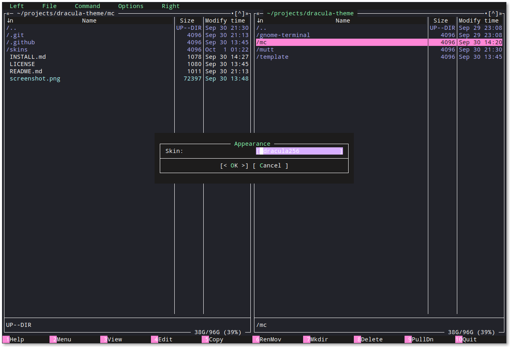

# Dracula for [Midnight Commander (mc)](https://midnight-commander.org/)

> A dark theme for [Midnight Commander (mc)](https://midnight-commander.org/)

The mc Dracula theme comes in two flavors, an 8/16 color option (`dracula.ini`) and a 256 color option (`dracula256.ini`).

The 8/16 theme is actually truer to the Dracula color palette than the 256 color version because the colors can be set more accurately in the terminal profile (albeit only a limited number allowed). The 256 color version has to use colors that are simply the closest match to the real palette so that they can be specified independently from the terminal color scheme.

## 8/16 Color

The 8/16 color version will work in terminals that don't support 256 colors but it is *entirely* dependent on the relevant Dracula theme for your terminal too. This version uses the color palette fixed by your terminal's Dracula theme and will not work in isolation. See [iTerm](https://draculatheme.com/iterm/) and [Gnome Terminal](https://draculatheme.com/gnome-terminal/) themes for example.

## 256 Color

The 256 color version will work regardless of terminal color schemes and profiles. It will not be affected if you change them. This theme requires your terminal to support 256 colors. (see [this FAQ](https://github.com/tmux/tmux/wiki/FAQ#how-do-i-use-a-256-colour-terminal) if you use tmux )

## Install

All instructions can be found at [draculatheme.com/midnight-commander](https://draculatheme.com/midnight-commander).

## Team

This theme is maintained by the following person(s) and a bunch of [awesome contributors](https://github.com/dracula/midnight-commander/graphs/contributors).

 |
--- |
[Darren Davison](https://github.com/davison) |

## License

[MIT License](./LICENSE)
